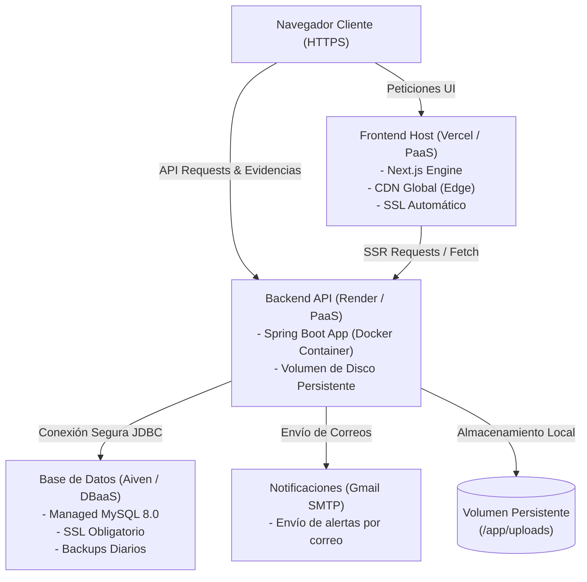

# Documentación Ejecutiva de Despliegue - Sistema de Visitas Inopinadas

Este documento presenta la estrategia de infraestructura, arquitectura de nube, costos y seguridad para la puesta en producción y operación del **Sistema de Visitas Inopinadas**. Está orientado a directores de TI, administradores de sistemas y patrocinadores del proyecto.

---

## 1. Resumen Ejecutivo

El **Sistema de Visitas Inopinadas** es una plataforma web modular (desacoplada en Backend, Frontend y Base de Datos) que digitaliza las auditorías y visitas a docentes universitarios en tiempo real. 

Para optimizar el costo-beneficio y acelerar el tiempo de salida a producción (Time-to-Market), se ha diseñado una arquitectura basada en **Servicios en la Nube Gestionados (PaaS y DBaaS)**. Este enfoque reduce la sobrecarga operativa, permitiendo delegar el mantenimiento del sistema operativo, parches de seguridad de base de datos y aprovisionamiento físico a proveedores especializados de nube.

---

## 2. Topología de Infraestructura en la Nube

El despliegue en producción aprovecha plataformas modernas que garantizan alta disponibilidad, certificados de seguridad integrados y despliegues automáticos basados en repositorios Git (GitOps).

---

## 3. Matriz de Componentes y Proveedores

| Componente | Tecnología | Proveedor Recomendado | Tipo de Servicio | Justificación / Ventajas |
| :--- | :--- | :--- | :--- | :--- |
| **Frontend** | Next.js 16 (React 19) | **Vercel** | PaaS (Platform as a Service) | - Integración nativa óptima para Next.js. - Red de Distribución de Contenido (CDN) integrada globalmente. - Compilación y despliegue automáticos integrados con GitHub (CI/CD). |
| **Backend API** | Spring Boot (Java 21) | **Render** / **Railway** | PaaS (Platform as a Service) | - Ejecución basada en contenedores Docker a partir del código fuente. - Aprovisionamiento fácil de almacenamiento en disco persistente. - Gestión centralizada de variables de entorno seguras. |
| **Base de Datos** | MySQL 8.0 | **Aiven** | DBaaS (Database as a Service) | - Instancia MySQL administrada sin necesidad de parches manuales. - Cifrado SSL/TLS obligatorio para todas las conexiones. - Respaldos diarios automatizados con retención. |
| **Notificaciones**| SMTP (Java Mail) | **Gmail SMTP** / **SendGrid** | SaaS (Software as a Service) | - Envío robusto de notificaciones y alertas por correo electrónico hacia docentes y auditores. |
| **Evidencias** | File System Local | **Render Disk** | Block Storage | - Montaje de disco persistente en el contenedor backend para conservar fotos/PDFs adjuntados por auditores. |

---

## 4. Estrategia de Entornos

Para asegurar la estabilidad operativa y evitar que los cambios afecten a los usuarios finales, se definen dos entornos aislados:

### A. Entorno de Desarrollo (Local / Staging)
*   **Propósito**: Desarrollo y pruebas internas de nuevas funcionalidades, depuración y migración de esquemas.
*   **Infraestructura**:
    *   **Base de Datos**: Instancia local MySQL o instancia Sandbox gratuita en Aiven.
    *   **Backend & Frontend**: Ejecutados localmente en la máquina del desarrollador (`mvnw spring-boot:run` y `npm run dev`).
    *   **Variables de Entorno**: Administradas localmente en archivos `.env.local` y perfiles de Spring Boot.

### B. Entorno de Producción (Cloud)
*   **Propósito**: Uso oficial por parte de la comunidad académica (administradores, auditores y docentes).
*   **Infraestructura**:
    *   **Base de Datos**: MySQL en Aiven con plan con alta disponibilidad y almacenamiento escalable.
    *   **Backend**: Contenedor Docker en Render (`Web Service`) configurado con escalado adecuado.
    *   **Frontend**: Alojamiento optimizado en producción en Vercel con HTTPS.
    *   **Evidencias**: Volumen de disco montado en la ruta `/app/uploads` del contenedor.

---

## 5. Proceso de Despliegue (a Grandes Rasgos)

El flujo de aprovisionamiento y despliegue del sistema se realiza en tres etapas integradas:

### A. Despliegue de la Base de Datos (Aiven MySQL)
1. **Creación del Servicio**: Se aprovisiona una base de datos gestionada MySQL 8.0 en la plataforma Aiven en pocos clics.
2. **Carga del Esquema Inicial**: Se ejecuta de forma remota el script [bd.sql](file:///c:/Users/quisp/Documents/GitHub/fullstack-backend/bd.sql) utilizando una conexión segura SSL (`--ssl-mode=REQUIRED`), lo que genera automáticamente la base de datos `db_visitas_inopinadas` con todas sus tablas, relaciones y datos iniciales de prueba.

### B. Despliegue del Backend (Spring Boot en Render)
1. **Compilación en Contenedor (Docker)**: Render detecta el archivo [Dockerfile](file:///c:/Users/quisp/Documents/GitHub/fullstack-backend/Dockerfile) del proyecto y compila el código Java 21 en una imagen Docker de manera automatizada.
2. **Volumen de Almacenamiento**: Se asocia un disco de almacenamiento persistente montado en la ruta `/app/uploads` para conservar de forma segura los archivos PDF y fotos subidos como evidencias.
3. **Variables de Entorno**: Se inyectan las credenciales de Aiven y el puerto de ejecución como variables de entorno privadas en Render, garantizando que el código no exponga datos sensibles.

### C. Despliegue del Frontend (Next.js en Vercel)
1. **Conexión con GitHub**: Vercel enlaza con el repositorio y detecta el proyecto Next.js en la subcarpeta correspondiente.
2. **Variables de Construcción (Build Time)**: Se inyecta la variable pública `NEXT_PUBLIC_API_URL` apuntando a la URL pública del backend en Render, permitiendo que el cliente web pueda comunicarse con la API.
3. **Compilación Estática e Implementación**: Vercel ejecuta la compilación de producción (`npm run build`) y propaga los recursos estáticos a través de su red global de distribución (CDN) para una carga ultrarrápida.

---

## 6. Análisis de Costos (Estimación de Arranque)

La arquitectura modular permite una puesta en marcha del proyecto con un **costo operativo inicial de $0.00 USD**, ofreciendo un camino de escalabilidad claro conforme aumenten el tráfico y los datos de la institución:

| Proveedor | Capacidad Inicial (Plan Gratuito / Hobby) | Costo Inicial | Escalamiento (Producción Recomendado) | Costo Escalamiento (Estimado) |
| :--- | :--- | :--- | :--- | :--- |
| **Vercel** (Frontend) | Plan Hobby (100 GB ancho de banda/mes) | `$0.00 USD / mes` | Plan Pro (Proyectos comerciales) | `$20.00 USD / usuario / mes` |
| **Render** (Backend) | 1 Web Service Compartido (512MB RAM) | `$0.00 USD / mes` | Web Service Starter (512MB - 2GB dedicada) | `$7.00 - $25.00 USD / mes` |
| **Render** (Storage) | Volumen de disco de 1 GB | `$0.00 USD / mes` | Almacenamiento adicional | `$0.25 USD / GB al mes` |
| **Aiven** (MySQL) | Plan Gratuito (1 vCPU, 1GB RAM, 5GB SSD) | `$0.00 USD / mes` | Plan Startup (HA / 2 vCPUs, 4GB RAM) | `$30.00 - $50.00 USD / mes` |
| **Gmail** (SMTP) | Cuenta Gmail estándar con límites de envío | `$0.00 USD / mes` | API de SendGrid o Google Workspace corporativo | `$15.00 USD / mes` (Opcional) |
| **Total Mensual** | **Fase Piloto / Pruebas** | **`$0.00 USD`** | **Fase Producción Oficial** | **`$57.00 - $95.00 USD`** |

---

## 7. Seguridad y Cumplimiento

La plataforma se despliega con altos estándares de seguridad informática a nivel corporativo:

*   **Cifrado de Datos en Tránsito**:
    *   **HTTP Seguro (HTTPS)**: Forzado automáticamente por Vercel (Frontend) y Render (Backend). Se rechaza cualquier petición sin cifrar.
    *   **Conexiones JDBC con SSL**: Configurado en Spring Boot (`useSSL=true` en [application.properties](file:///c:/Users/quisp/Documents/GitHub/fullstack-backend/src/main/resources/application.properties)) y forzado por Aiven (`--ssl-mode=REQUIRED`), protegiendo los datos en tránsito frente a ataques de intercepción.
*   **Autenticación Robusta**:
    *   **Tokens JWT**: Firmados digitalmente con algoritmos HMAC-256 usando claves secretas de alta entropía. Las claves se inyectan como variables de entorno privadas en la nube y nunca se guardan en el repositorio.
    *   **Control de Acceso Basado en Roles (RBAC)**: Autorización rigurosa a nivel de cada endpoint (`@PreAuthorize`) para asegurar que solo los usuarios autorizados (ej. `ADMIN`, `AUDITOR`) puedan interactuar con operaciones críticas.
*   **Gestión Segura de Secretos**:
    *   Exclusión de credenciales (passwords de base de datos, contraseñas SMTP, secretos de JWT) del código fuente mediante el uso de variables de entorno de la nube.
*   **Copias de Seguridad (Backups)**:
    *   Copias de seguridad del esquema y registros en Aiven diarias y automatizadas, permitiendo la recuperación rápida ante fallos imprevistos.

---

## 8. Plan de Continuidad y Recuperación

1.  **Persistencia de Archivos Adjuntos**:
    *   Dado que las evidencias se guardan localmente en `/app/uploads` en el backend, la utilización de un disco virtual persistente de Render garantiza que no se pierdan documentos cuando se actualice el código o se reinicie el contenedor.
2.  **Monitoreo y Diagnóstico**:
    *   Uso de consolas de monitoreo en tiempo real (CPU, RAM, logs de base de datos en Aiven y logs del contenedor en Render) para la resolución oportuna de cualquier incidencia operacional.
3.  **Health Checks**:
    *   Configuración de endpoints de salud (`/api/health`) para que las plataformas en la nube puedan validar la disponibilidad del backend y realizar autoreinicios preventivos en caso de bloqueos.
